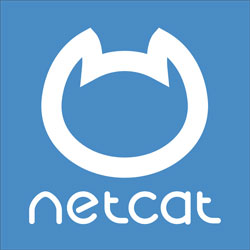

Global Socket allows two workstations on different private networks to communicate with each other. Through firewalls and through NAT - like there is no firewall.

<script src="https://asciinema.org/a/lL94Vsjz8JM0hCjnfKM173Ong.js" id="asciicast-lL94Vsjz8JM0hCjnfKM173Ong" async data-autoplay="true" data-speed="2" ></script>


An often used example is to start SSHD on a firewalled workstation:
```shell
root@ALICE:~# gsocket -s ExampleSecretChangeMe /usr/sbin/sshd -D
```

...and then access this *hidden service* from anywhere else in the world:
```shell
bob@BOB:~$ gsocket -s ExampleSecretChangeMe ssh bob@gsocket
gsocket: =Secret         :"ExampleSecretChangeMe"
gsocket: =Encryption     : SRP-AES-256-CBC-SHA-End2End (Prime: 4096 bits)
Welcome to Ubuntu 20.04.1 LTS (GNU/Linux 5.4.0-65-generic x86_64)
bob@ALICE:~$ 
```
There are [trillions of examples](https://github.com/hackerschoice/gsocket/tree/master/examples) and even more on our [GitHub Page](https://github.com/hackerschoice/gsocket).  

Get Involved. We are looking for volunteers to work on the website and a logo and to discuss new ideas. [Join us on telegram](https://t.me/thcorg).

## Compatible with
{:refdef: style="text-align: center;"}

{:height="30%" width="30%"}  
{:height="20%" width="20%"}  
{:height="40%" width="40%"}  
{:height="50%" width="50%"}  
{:height="60%" width="60%"}  
***and many more...***  
{: refdef}


